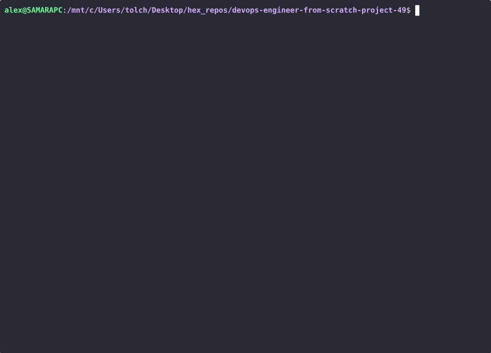
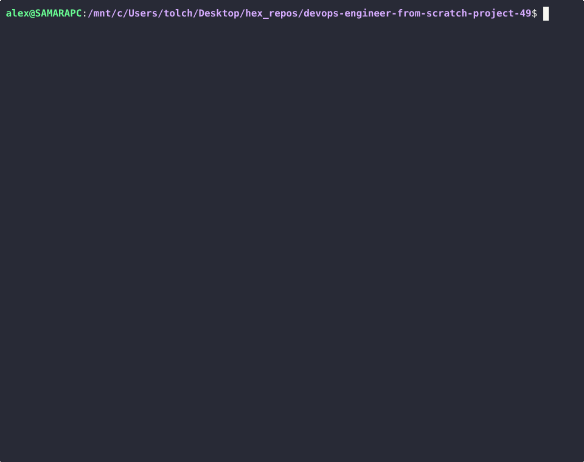
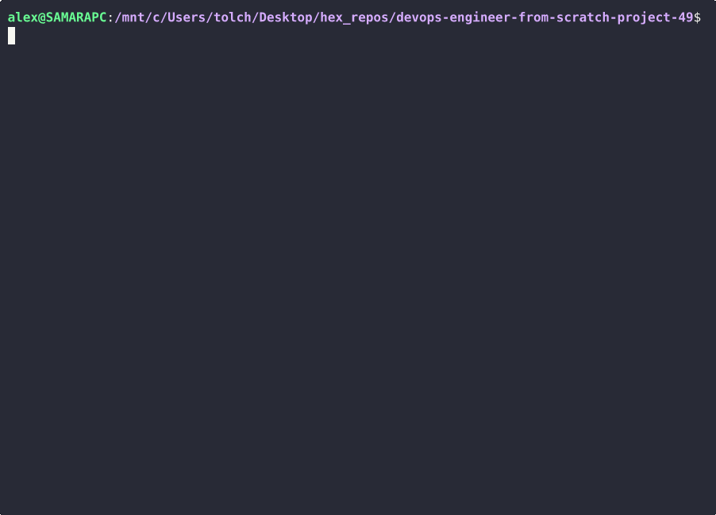

# Brain Games

A set of simple CLI games: answer three questions in a row to win. Games include **brain-even** (is the number even?), **brain-calc** (result of an expression), **brain-gcd** (greatest common divisor), **brain-progression** (missing number in a sequence), **brain-prime** (is the number prime?).

## Requirements

- Python 3.10 or higher
- [uv](https://github.com/astral-sh/uv) (recommended) or pip

## Installation

Clone the repository and install dependencies:

```bash
git clone https://github.com/Alex-tolch/devops-engineer-from-scratch-project-49.git
cd devops-engineer-from-scratch-project-49
```

With **uv**:

```bash
uv sync
```

With **pip**:

```bash
pip install -e .
```

## Usage

Run a game (with uv):

```bash
uv run brain-games      # welcome only
uv run brain-even       # even/odd
uv run brain-calc       # arithmetic
uv run brain-gcd        # GCD
uv run brain-progression # progression
uv run brain-prime      # prime number
```

Or use **Make**:

```bash
make brain-games
make brain-even
make brain-calc
make brain-gcd
make brain-progression
make brain-prime
```

After a global install (`make build` then `make package-install`), you can run `brain-even`, `brain-calc`, etc. directly.

---

### Hexlet tests and linter status:
[](https://github.com/Alex-tolch/devops-engineer-from-scratch-project-49/actions)
[](https://sonarcloud.io/summary/new_code?id=Alex-tolch_devops-engineer-from-scratch-project-49)
[](https://sonarcloud.io/summary/new_code?id=Alex-tolch_devops-engineer-from-scratch-project-49)
[](https://sonarcloud.io/summary/new_code?id=Alex-tolch_devops-engineer-from-scratch-project-49)
[](https://sonarcloud.io/summary/new_code?id=Alex-tolch_devops-engineer-from-scratch-project-49)
[](https://sonarcloud.io/summary/new_code?id=Alex-tolch_devops-engineer-from-scratch-project-49)
[](https://sonarcloud.io/summary/new_code?id=Alex-tolch_devops-engineer-from-scratch-project-49)
[](https://sonarcloud.io/summary/new_code?id=Alex-tolch_devops-engineer-from-scratch-project-49)
[](https://sonarcloud.io/summary/new_code?id=Alex-tolch_devops-engineer-from-scratch-project-49)
[](https://sonarcloud.io/summary/new_code?id=Alex-tolch_devops-engineer-from-scratch-project-49)
[](https://sonarcloud.io/summary/new_code?id=Alex-tolch_devops-engineer-from-scratch-project-49)

## Demo

### brain-even


### brain-calc


### brain-gcd


### brain-progression


### brain-prime

